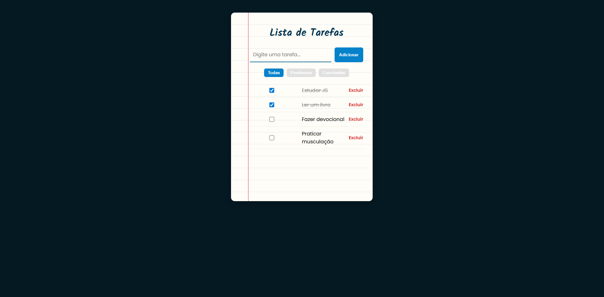

# 📋 Lista de Tarefas - Estilo Caderno

Uma aplicação de **lista de tarefas (To-Do List)** desenvolvida em **HTML, CSS e JavaScript**, com visual inspirado em um **caderno de anotações** 📒.  
O projeto permite adicionar, concluir, excluir e filtrar tarefas, tudo com armazenamento local no navegador.

---

## 🚀 Demonstração

Acesse a versão online: [👉 Deploy no GitHub Pages](https://victorcarvalhob.github.io/lista-de-tarefas/)

---

## ✨ Funcionalidades

- ✅ Adicionar novas tarefas
- ✏️ Marcar tarefas como concluídas
- ❌ Excluir tarefas
- 🔎 Filtros de visualização:
  - Todas
  - Pendentes
  - Concluídas
- 💾 Salvamento automático no **LocalStorage**
- 📱 Layout **responsivo** para desktop e mobile
- 🎨 Estilo diferenciado inspirado em um **caderno/bloco de notas**

---

## 🛠️ Tecnologias Utilizadas

- **HTML5** → Estrutura semântica da aplicação
- **CSS3** → Estilização (inclui responsividade e animações)
- **JavaScript (ES6+)** → Lógica e interatividade
- **LocalStorage** → Armazenamento dos dados no navegador

---
